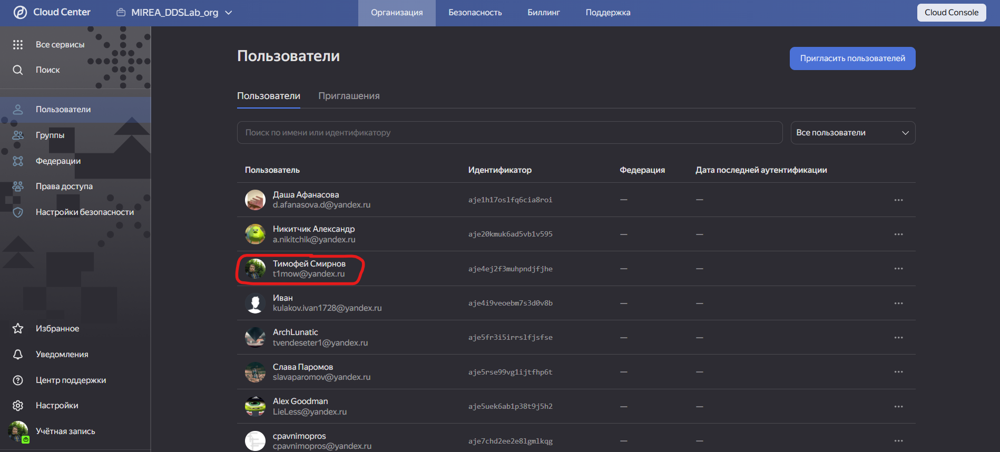
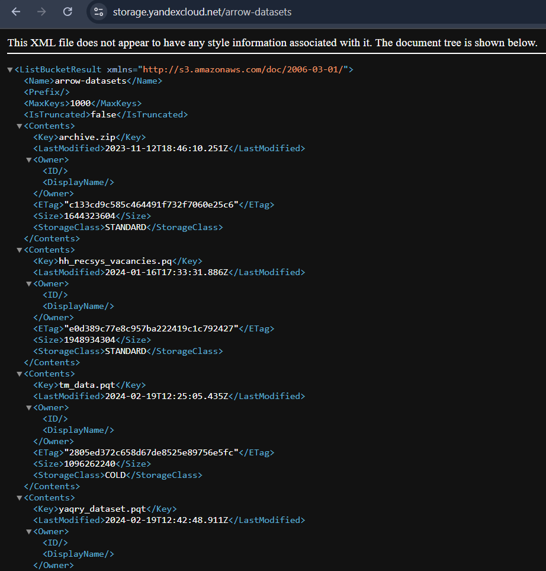
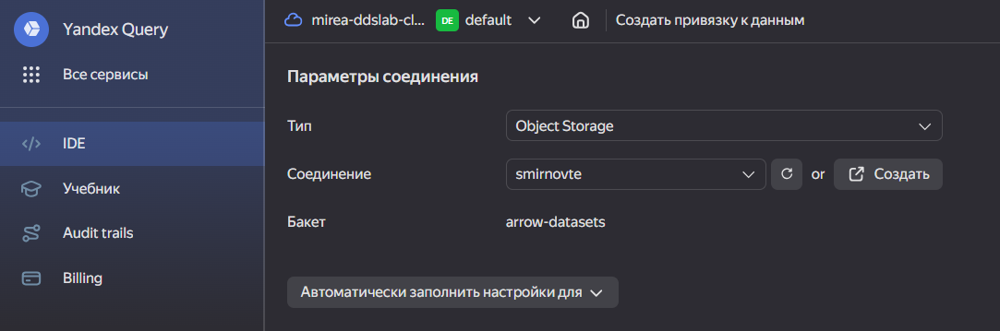
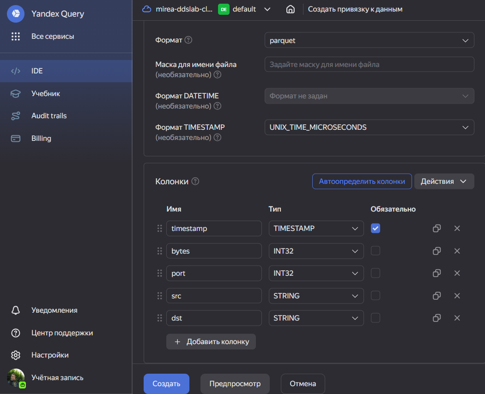
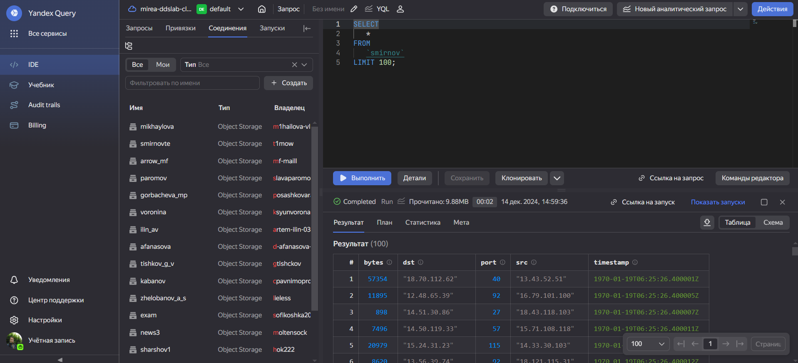
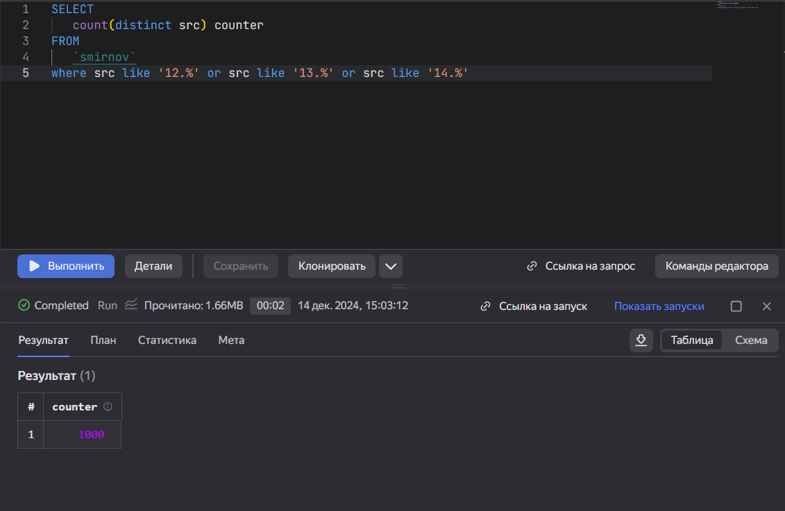
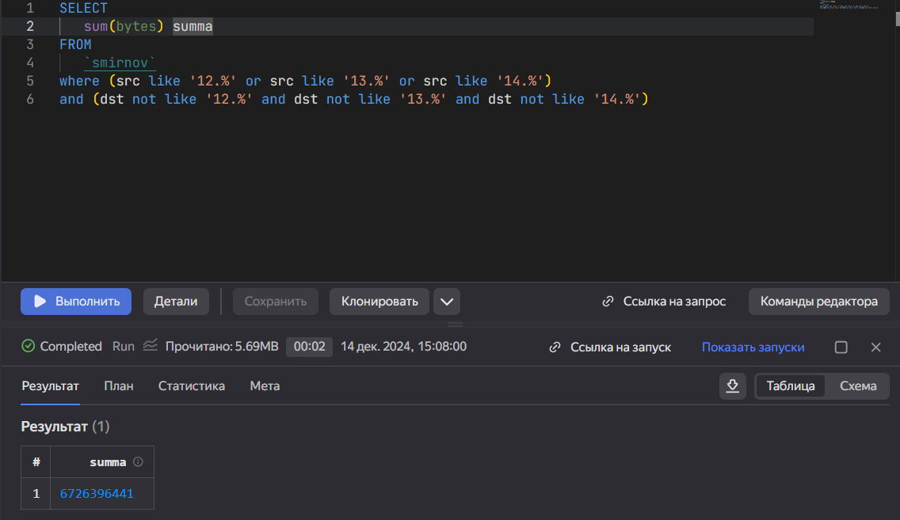
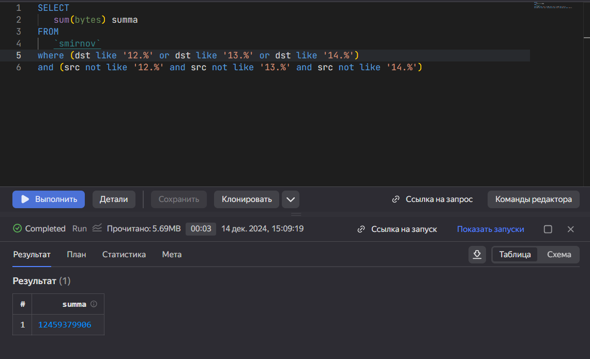

# Отчёт for Lab 4
t1mow@yandex.ru

# Лабораторная работа №4

## Цель работы

Изучить возможности технологии Yandex Query для анализа
структурированных наборов данных  
Получить навыки построения аналитического пайплайна для анализа данных с
помощью сервисов Yandex Cloud  
Закрепить практические навыки использования SQL для анализа данных
сетевой активности в сегментированной корпоративной сети

## Исходные данные

1.  Программное обеспечение Windows 11 Pro
2.  Rstudio Desktop
3.  Интерпретатор языка R 4.4.2
4.  Git и Github
5.  Аккаунт в Yandex Cloud Organization

## Шаги

1.  Принимаем приглашение с почты и присоединяемся к организации



1.  Проверяем доступность данных с помощью сконструированного URL



1.  Заходим в облако mirea-ddslab-cloud, создаем собственное соединение
    по своей фамилии

 

1.  Проверяем работоспособность соединения с помощью простого запроса



1.  Выполняем задания:

<!-- -->

1.  Известно, что IP адреса внутренней сети начинаются с октетов,
    принадлежащих интервалу \[12-14\] Определите количество хостов
    внутренней сети, представленных в датасете



1.  Определите суммарный объем исходящего трафика



1.  Определите суммарный объем входящего трафика



## Оценка результата

``` r
print('SmirnovTE')
```

    [1] "SmirnovTE"

В результате работы было установлено собственное соединение с датасетом
и выполнены все задания

## Вывод

Были улучшены навыки написания SQL-запросов, а также был проанализирован
датасет исходящего и входящего трафиков.
