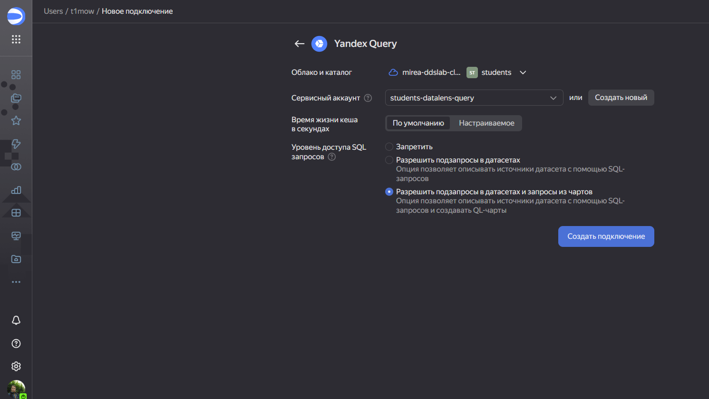
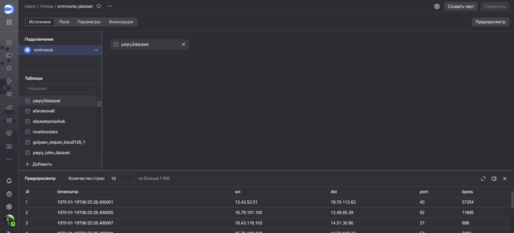
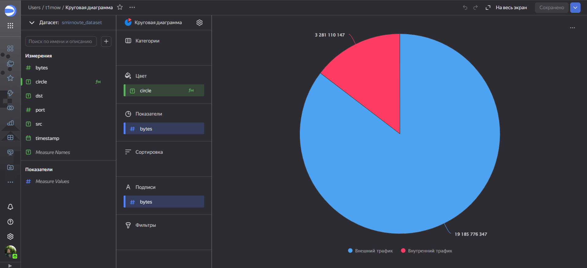
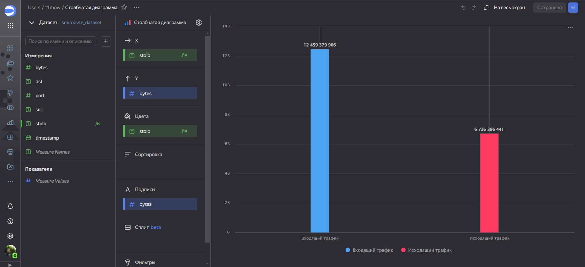
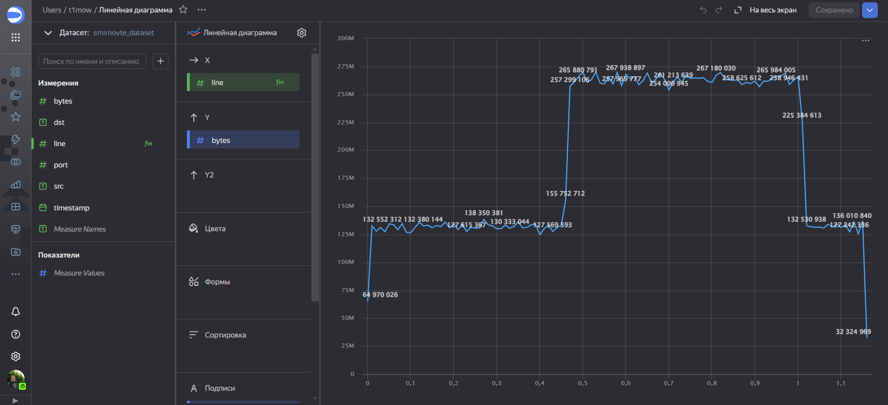
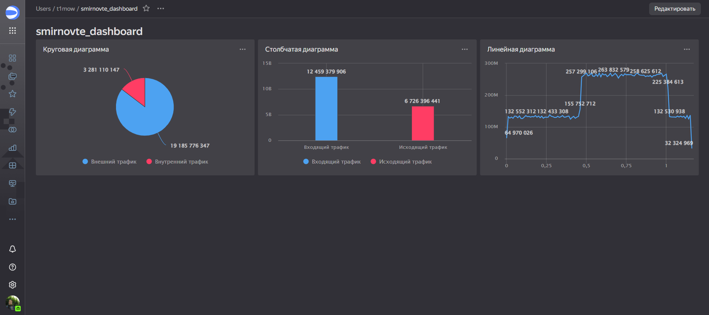

# Отчёт for Lab 6
t1mow@yandex.ru

# Лабораторная работа №6

## Цель работы

Изучить возможности технологии Yandex Query для визуального анализа
структурированных наборов данных  
Получить навыки визуализации данных для последующего анализа с помощью
сервисов Yandex Cloud  
Получить навыки создания решений мониторинга/SIEM на базе облачных
продуктов и открытых программных решений  
Закрепить практические навыки использования SQL для анализа данных
сетевой активности в сегментированной корпоративной сети

## Исходные данные

1.  Программное обеспечение Windows 11 Pro
2.  Rstudio Desktop
3.  Интерпретатор языка R 4.4.1
4.  Git и Github
5.  Аккаунт в Yandex Cloud Organization

## Шаги

1.  Настраиваем подключение к YandexQuery из DataLens



1.  Создаем датасет со своим именем с таблицей yaqry2dataset



1.  Создаем чарты и оформляем их в соответствии с заданием:

<!-- -->

1.  Представить в виде круговой диаграммы соотношение внешнего и
    внутреннего сетевого трафика



1.  Представить в виде столбчатой диаграммы соотношение входящего и
    исходящего трафика из внутреннего сетвого сегмента



1.  Построить график активности (линейная диаграмма) объема трафика во
    времени



1.  Спроектировать дашборд, имея в наличии созданные чарты



Ссылка на дашборд: [Yandex DataLens Dashboard](https://datalens.yandex.cloud/vhyu868x837wi)

## Оценка результата

``` r
print('SmirnovTE')
```

    [1] "SmirnovTE"

В результате работы был создан датасет, в нём созданы чарты и с помощью
них сделан итоговый дашборд

## Вывод

Были получены навыки визуализации данных, для последующего анализа с
помощью Yandex Cloud, а также изучены методы работы с данными в Yandex
Datalens.
