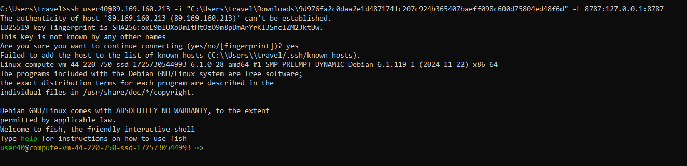
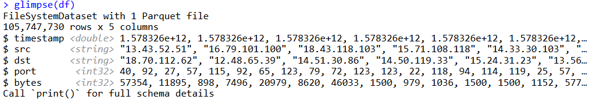
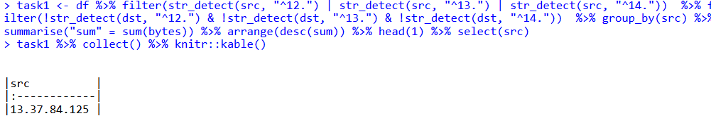
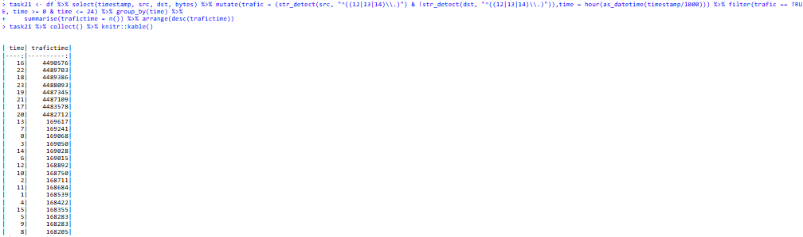
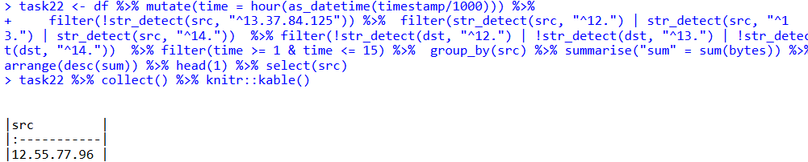
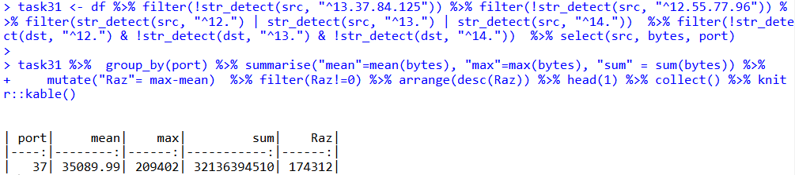
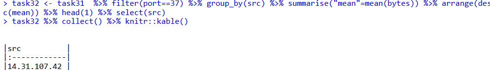

# Отчёт for Lab 7
t1mow@yandex.ru

# Лабораторная работа №7

## Цель работы

Изучить возможности технологии Apache Arrow для обработки и анализ больших данных      
Получить навыки применения Arrow совместно с языком программирования R      
Получить навыки анализа метаинфомации о сетевом трафике     
Получить навыки применения облачных технологий хранения, подготовки и анализа данных: Yandex Object Storage, Rstudio Server

## Исходные данные

1.  Программное обеспечение Windows 11 Pro
2.  Rstudio Desktop
3.  Rstudio Server
4.  Интерпретатор языка R 4.4.1
5.  Git и Github
6.  Yandex Object Storage

## Шаги

1.  Импортируем данные с помощью библиотеки arrow

``` r
library(arrow)
```

    Some features are not enabled in this build of Arrow. Run `arrow_info()` for more information.


    Attaching package: 'arrow'

    The following object is masked from 'package:utils':

        timestamp

``` r
library(dplyr)
```


    Attaching package: 'dplyr'

    The following objects are masked from 'package:stats':

        filter, lag

    The following objects are masked from 'package:base':

        intersect, setdiff, setequal, union

``` r
library(tidyverse)
```

    ── Attaching core tidyverse packages ──────────────────────── tidyverse 2.0.0 ──
    ✔ forcats   1.0.0     ✔ readr     2.1.5
    ✔ ggplot2   3.5.1     ✔ stringr   1.5.1
    ✔ lubridate 1.9.3     ✔ tibble    3.2.1
    ✔ purrr     1.0.2     ✔ tidyr     1.3.1

    ── Conflicts ────────────────────────────────────────── tidyverse_conflicts() ──
    ✖ lubridate::duration() masks arrow::duration()
    ✖ dplyr::filter()       masks stats::filter()
    ✖ dplyr::lag()          masks stats::lag()
    ℹ Use the conflicted package (<http://conflicted.r-lib.org/>) to force all conflicts to become errors

``` r
download.file("https://storage.yandexcloud.net/arrow-datasets/tm_data.pqt",destfile = "tm_data.pqt")
df <- arrow::open_dataset(sources = "tm_data.pqt", format = "parquet")
```

  

``` r
glimpse(df)
```

    FileSystemDataset with 1 Parquet file
    105,747,730 rows x 5 columns
    $ timestamp <double> 1.578326e+12, 1.578326e+12, 1.578326e+12, 1.578326e+12, 1.5…
    $ src       <string> "13.43.52.51", "16.79.101.100", "18.43.118.103", "15.71.108…
    $ dst       <string> "18.70.112.62", "12.48.65.39", "14.51.30.86", "14.50.119.33…
    $ port       <int32> 40, 92, 27, 57, 115, 92, 65, 123, 79, 72, 123, 123, 22, 118…
    $ bytes      <int32> 57354, 11895, 898, 7496, 20979, 8620, 46033, 1500, 979, 103…
    Call `print()` for full schema details

1.  Приступаем к выполнению заданий

<!-- -->

1.  Найдите утечку данных из вашей сети



``` r
task1 <- df %>% filter(str_detect(src, "^12.") | str_detect(src, "^13.") | str_detect(src, "^14."))  %>% filter(!str_detect(dst, "^12.") & !str_detect(dst, "^13.") & !str_detect(dst, "^14."))  %>% group_by(src) %>% summarise("sum" = sum(bytes)) %>% arrange(desc(sum)) %>% head(1) %>% select(src) 
task1 %>% collect() %>% knitr::kable()
```

<table>
<thead>
<tr class="header">
<th style="text-align: left;">src</th>
</tr>
</thead>
<tbody>
<tr class="odd">
<td style="text-align: left;">13.37.84.125</td>
</tr>
</tbody>
</table>

1.  Найдите утечку данных 2

Для начала нужно определить рабочее время  
Для этого можно использовать нагрузку на трафик, и выцепить час с сортировкой по количеству трафика



``` r
task21 <- df %>% select(timestamp, src, dst, bytes) %>% mutate(trafic = (str_detect(src, "^((12|13|14)\\.)") & !str_detect(dst, "^((12|13|14)\\.)")),time = hour(as_datetime(timestamp/1000))) %>% filter(trafic == TRUE, time >= 0 & time <= 24) %>% group_by(time) %>%
summarise(trafictime = n()) %>% arrange(desc(trafictime))
task21 %>% collect() %>% knitr::kable()
```

<table>
<thead>
<tr class="header">
<th style="text-align: right;">time</th>
<th style="text-align: right;">trafictime</th>
</tr>
</thead>
<tbody>
<tr class="odd">
<td style="text-align: right;">16</td>
<td style="text-align: right;">4490576</td>
</tr>
<tr class="even">
<td style="text-align: right;">22</td>
<td style="text-align: right;">4489703</td>
</tr>
<tr class="odd">
<td style="text-align: right;">18</td>
<td style="text-align: right;">4489386</td>
</tr>
<tr class="even">
<td style="text-align: right;">23</td>
<td style="text-align: right;">4488093</td>
</tr>
<tr class="odd">
<td style="text-align: right;">19</td>
<td style="text-align: right;">4487345</td>
</tr>
<tr class="even">
<td style="text-align: right;">21</td>
<td style="text-align: right;">4487109</td>
</tr>
<tr class="odd">
<td style="text-align: right;">17</td>
<td style="text-align: right;">4483578</td>
</tr>
<tr class="even">
<td style="text-align: right;">20</td>
<td style="text-align: right;">4482712</td>
</tr>
<tr class="odd">
<td style="text-align: right;">13</td>
<td style="text-align: right;">169617</td>
</tr>
<tr class="even">
<td style="text-align: right;">7</td>
<td style="text-align: right;">169241</td>
</tr>
<tr class="odd">
<td style="text-align: right;">0</td>
<td style="text-align: right;">169068</td>
</tr>
<tr class="even">
<td style="text-align: right;">3</td>
<td style="text-align: right;">169050</td>
</tr>
<tr class="odd">
<td style="text-align: right;">14</td>
<td style="text-align: right;">169028</td>
</tr>
<tr class="even">
<td style="text-align: right;">6</td>
<td style="text-align: right;">169015</td>
</tr>
<tr class="odd">
<td style="text-align: right;">12</td>
<td style="text-align: right;">168892</td>
</tr>
<tr class="even">
<td style="text-align: right;">10</td>
<td style="text-align: right;">168750</td>
</tr>
<tr class="odd">
<td style="text-align: right;">2</td>
<td style="text-align: right;">168711</td>
</tr>
<tr class="even">
<td style="text-align: right;">11</td>
<td style="text-align: right;">168684</td>
</tr>
<tr class="odd">
<td style="text-align: right;">1</td>
<td style="text-align: right;">168539</td>
</tr>
<tr class="even">
<td style="text-align: right;">4</td>
<td style="text-align: right;">168422</td>
</tr>
<tr class="odd">
<td style="text-align: right;">15</td>
<td style="text-align: right;">168355</td>
</tr>
<tr class="even">
<td style="text-align: right;">9</td>
<td style="text-align: right;">168283</td>
</tr>
<tr class="odd">
<td style="text-align: right;">5</td>
<td style="text-align: right;">168283</td>
</tr>
<tr class="even">
<td style="text-align: right;">8</td>
<td style="text-align: right;">168205</td>
</tr>
</tbody>
</table>

По данным выясняем, что рабочим временем является 16-23



``` r
task22 <- df %>% mutate(time = hour(as_datetime(timestamp/1000))) %>% 
filter(!str_detect(src, "^13.37.84.125")) %>%  filter(str_detect(src, "^12.") | str_detect(src, "^13.") | str_detect(src, "^14."))  %>% filter(!str_detect(dst, "^12.") | !str_detect(dst, "^13.") | !str_detect(dst, "^14."))  %>% filter(time >= 1 & time <= 15) %>%  group_by(src) %>% summarise("sum" = sum(bytes)) %>% arrange(desc(sum)) %>% head(1) %>% select(src) 
task22 %>% collect() %>% knitr::kable()
```

<table>
<thead>
<tr class="header">
<th style="text-align: left;">src</th>
</tr>
</thead>
<tbody>
<tr class="odd">
<td style="text-align: left;">12.55.77.96</td>
</tr>
</tbody>
</table>

1.  Найдите утечку данных 3



``` r
task31 <- df %>% filter(!str_detect(src, "^13.37.84.125")) %>% filter(!str_detect(src, "^12.55.77.96")) %>% filter(str_detect(src, "^12.") | str_detect(src, "^13.") | str_detect(src, "^14."))  %>% filter(!str_detect(dst, "^12.") & !str_detect(dst, "^13.") & !str_detect(dst, "^14."))  %>% select(src, bytes, port)

task31 %>%  group_by(port) %>% summarise("mean"=mean(bytes), "max"=max(bytes), "sum" = sum(bytes)) %>% 
  mutate("Raz"= max-mean)  %>% filter(Raz!=0) %>% arrange(desc(Raz)) %>% head(1) %>% collect() %>% knitr::kable()
```

<table>
<thead>
<tr class="header">
<th style="text-align: right;">port</th>
<th style="text-align: right;">mean</th>
<th style="text-align: right;">max</th>
<th style="text-align: right;">sum</th>
<th style="text-align: right;">Raz</th>
</tr>
</thead>
<tbody>
<tr class="odd">
<td style="text-align: right;">37</td>
<td style="text-align: right;">35089.99</td>
<td style="text-align: right;">209402</td>
<td style="text-align: right;">32136394510</td>
<td style="text-align: right;">174312</td>
</tr>
</tbody>
</table>



``` r
task32 <- task31  %>% filter(port==37) %>% group_by(src) %>% summarise("mean"=mean(bytes)) %>% arrange(desc(mean)) %>% head(1) %>% select(src)
task32 %>% collect() %>% knitr::kable()
```

<table>
<thead>
<tr class="header">
<th style="text-align: left;">src</th>
</tr>
</thead>
<tbody>
<tr class="odd">
<td style="text-align: left;">14.31.107.42</td>
</tr>
</tbody>
</table>

## Оценка результата

Зашли на сервер, скачали пакет данных tm_data и выполнили три задания по поиску утечки данных

## Вывод

Мы ознакомились с применением облачных технологий хранения, подготовки и анализа данных, а также проанализировали метаинформацию о сетевом трафике.
