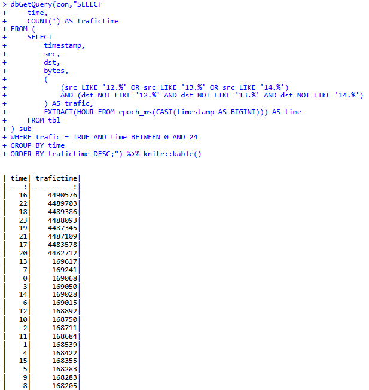
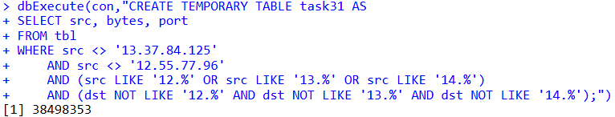

# Отчёт for Lab 8
t1mow@yandex.ru

# Лабораторная работа №8

## Цель работы

Изучить возможности СУБД DuckDB для обработки и анализ больших данных   
Получить навыки применения DuckDB совместно с языком программирования R     
Получить навыки анализа метаинфомации о сетевом трафике     
Получить навыки применения облачных технологий хранения, подготовки и анализа данных: Yandex Object Storage, Rstudio Server.

## Исходные данные

1.  Программное обеспечение Windows 11 Pro
2.  Rstudio Desktop
3.  Rstudio Server
4.  Интерпретатор языка R 4.4.1
5.  Git и Github
6.  Данные tm_data.pqt

## Шаги

1.  Заходим на Rstudio Server и меняем пароль

  

1.  Скачиваем данные с поомщью функции download.file

``` r
options(timeout = 1000)
download.file("https://storage.yandexcloud.net/arrow-datasets/tm_data.pqt",destfile = "tm_data.pqt")
```

1.  Загружаем данные пакета в таблицу tbl

``` r
library(duckdb)
```

    Loading required package: DBI

``` r
library(dplyr)
```


    Attaching package: 'dplyr'

    The following objects are masked from 'package:stats':

        filter, lag

    The following objects are masked from 'package:base':

        intersect, setdiff, setequal, union

``` r
con <- dbConnect(duckdb())
dbExecute(con,"CREATE TABLE tbl as SELECT * FROM read_parquet('tm_data.pqt')")
```

    [1] 105747730


1.  Приступаем к выполнению заданий

<!-- -->

1.  Найдите утечку данных из вашей сети


``` r
dbGetQuery(con,"SELECT src FROM tbl
WHERE (src LIKE '12.%' OR src LIKE '13.%' OR src LIKE '14.%') 
AND NOT (dst LIKE '12.%' AND dst LIKE '13.%' AND dst LIKE '14.%')
GROUP BY src
order by sum(bytes) desc
limit 1") %>% knitr::kable()
```

<table>
<thead>
<tr class="header">
<th style="text-align: left;">src</th>
</tr>
</thead>
<tbody>
<tr class="odd">
<td style="text-align: left;">13.37.84.125</td>
</tr>
</tbody>
</table>

1.  Найдите утечку данных 2



``` r
dbGetQuery(con,"SELECT 
    time,
    COUNT(*) AS trafictime
FROM (
    SELECT 
        timestamp,
        src,
        dst,
        bytes,
        (
            (src LIKE '12.%' OR src LIKE '13.%' OR src LIKE '14.%')
            AND (dst NOT LIKE '12.%' AND dst NOT LIKE '13.%' AND dst NOT LIKE '14.%')
        ) AS trafic,
        EXTRACT(HOUR FROM epoch_ms(CAST(timestamp AS BIGINT))) AS time
    FROM tbl
) sub
WHERE trafic = TRUE AND time BETWEEN 0 AND 24
GROUP BY time
ORDER BY trafictime DESC;") %>% knitr::kable()
```

<table>
<thead>
<tr class="header">
<th style="text-align: right;">time</th>
<th style="text-align: right;">trafictime</th>
</tr>
</thead>
<tbody>
<tr class="odd">
<td style="text-align: right;">16</td>
<td style="text-align: right;">4490576</td>
</tr>
<tr class="even">
<td style="text-align: right;">22</td>
<td style="text-align: right;">4489703</td>
</tr>
<tr class="odd">
<td style="text-align: right;">18</td>
<td style="text-align: right;">4489386</td>
</tr>
<tr class="even">
<td style="text-align: right;">23</td>
<td style="text-align: right;">4488093</td>
</tr>
<tr class="odd">
<td style="text-align: right;">19</td>
<td style="text-align: right;">4487345</td>
</tr>
<tr class="even">
<td style="text-align: right;">21</td>
<td style="text-align: right;">4487109</td>
</tr>
<tr class="odd">
<td style="text-align: right;">17</td>
<td style="text-align: right;">4483578</td>
</tr>
<tr class="even">
<td style="text-align: right;">20</td>
<td style="text-align: right;">4482712</td>
</tr>
<tr class="odd">
<td style="text-align: right;">13</td>
<td style="text-align: right;">169617</td>
</tr>
<tr class="even">
<td style="text-align: right;">7</td>
<td style="text-align: right;">169241</td>
</tr>
<tr class="odd">
<td style="text-align: right;">0</td>
<td style="text-align: right;">169068</td>
</tr>
<tr class="even">
<td style="text-align: right;">3</td>
<td style="text-align: right;">169050</td>
</tr>
<tr class="odd">
<td style="text-align: right;">14</td>
<td style="text-align: right;">169028</td>
</tr>
<tr class="even">
<td style="text-align: right;">6</td>
<td style="text-align: right;">169015</td>
</tr>
<tr class="odd">
<td style="text-align: right;">12</td>
<td style="text-align: right;">168892</td>
</tr>
<tr class="even">
<td style="text-align: right;">10</td>
<td style="text-align: right;">168750</td>
</tr>
<tr class="odd">
<td style="text-align: right;">2</td>
<td style="text-align: right;">168711</td>
</tr>
<tr class="even">
<td style="text-align: right;">11</td>
<td style="text-align: right;">168684</td>
</tr>
<tr class="odd">
<td style="text-align: right;">1</td>
<td style="text-align: right;">168539</td>
</tr>
<tr class="even">
<td style="text-align: right;">4</td>
<td style="text-align: right;">168422</td>
</tr>
<tr class="odd">
<td style="text-align: right;">15</td>
<td style="text-align: right;">168355</td>
</tr>
<tr class="even">
<td style="text-align: right;">5</td>
<td style="text-align: right;">168283</td>
</tr>
<tr class="odd">
<td style="text-align: right;">9</td>
<td style="text-align: right;">168283</td>
</tr>
<tr class="even">
<td style="text-align: right;">8</td>
<td style="text-align: right;">168205</td>
</tr>
</tbody>
</table>


``` r
dbGetQuery(con,"
SELECT src
FROM (
    SELECT src, SUM(bytes) AS total_bytes
    FROM (
        SELECT *,
            EXTRACT(HOUR FROM epoch_ms(CAST(timestamp AS BIGINT))) AS time
        FROM tbl
    ) sub
    WHERE src <> '13.37.84.125'
        AND (src LIKE '12.%' OR src LIKE '13.%' OR src LIKE '14.%')
        AND (dst NOT LIKE '12.%' AND dst NOT LIKE '13.%' AND dst NOT LIKE '14.%')
        AND time BETWEEN 1 AND 15
    GROUP BY src
) grp
ORDER BY total_bytes DESC
LIMIT 1;") %>% knitr::kable()
```

<table>
<thead>
<tr class="header">
<th style="text-align: left;">src</th>
</tr>
</thead>
<tbody>
<tr class="odd">
<td style="text-align: left;">12.55.77.96</td>
</tr>
</tbody>
</table>

1.  Найдите утечку данных 3



``` r
dbExecute(con,"CREATE TEMPORARY TABLE task31 AS
SELECT src, bytes, port
FROM tbl
WHERE src <> '13.37.84.125'
    AND src <> '12.55.77.96'
    AND (src LIKE '12.%' OR src LIKE '13.%' OR src LIKE '14.%')
    AND (dst NOT LIKE '12.%' AND dst NOT LIKE '13.%' AND dst NOT LIKE '14.%');")
```

    [1] 38498353


``` r
dbGetQuery(con,"SELECT port, AVG(bytes) AS mean_bytes, MAX(bytes) AS max_bytes, SUM(bytes) AS sum_bytes, MAX(bytes) - AVG(bytes) AS Raz
FROM task31
GROUP BY port
HAVING MAX(bytes) - AVG(bytes) != 0
ORDER BY Raz DESC
LIMIT 1;") %>% knitr::kable()
```

<table>
<thead>
<tr class="header">
<th style="text-align: right;">port</th>
<th style="text-align: right;">mean_bytes</th>
<th style="text-align: right;">max_bytes</th>
<th style="text-align: right;">sum_bytes</th>
<th style="text-align: right;">Raz</th>
</tr>
</thead>
<tbody>
<tr class="odd">
<td style="text-align: right;">37</td>
<td style="text-align: right;">35089.99</td>
<td style="text-align: right;">209402</td>
<td style="text-align: right;">32136394510</td>
<td style="text-align: right;">174312</td>
</tr>
</tbody>
</table>


``` r
dbGetQuery(con,"SELECT src
FROM (
    SELECT src, AVG(bytes) AS mean_bytes
    FROM task31
    WHERE port = 37
    GROUP BY src
) AS task32
ORDER BY mean_bytes DESC
LIMIT 1;") %>% knitr::kable()
```

<table>
<thead>
<tr class="header">
<th style="text-align: left;">src</th>
</tr>
</thead>
<tbody>
<tr class="odd">
<td style="text-align: left;">14.31.107.42</td>
</tr>
</tbody>
</table>

## Оценка результата

Зашли на сервер, скачали пакет данных tm_data и проанализировали эти данные, а также выполнили три задания по поиску утечки данных

## Вывод

Мы ознакомились с применением облачных технологий хранения, подготовки и анализа данных, а также проанализировали метаинформацию о сетевом трафике.